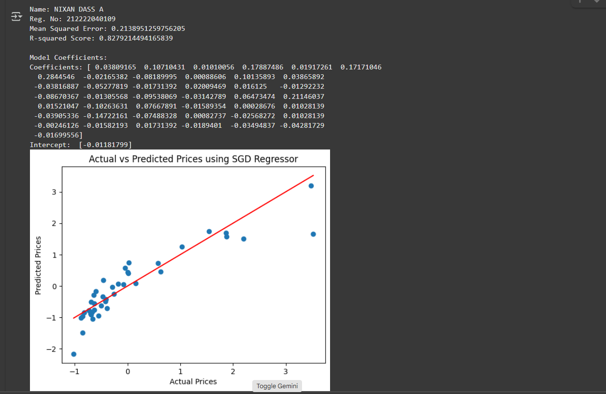

# BLENDED_LEARNING
# Implementation-of-Stochastic-Gradient-Descent-SGD-Regressor

## AIM:
To write a program to implement Stochastic Gradient Descent (SGD) Regressor for linear regression and evaluate its performance.

## Equipments Required:
1. Hardware – PCs
2. Anaconda – Python 3.7 Installation / Jupyter notebook

## Algorithm
1. 
2. 
3. 
4. 

## Program:
```
/*
Program to implement SGD Regressor for linear regression.
Developed by: NIXAN DASS A
RegisterNumber:  212222040109
*/

import pandas as pd
import numpy as np
import matplotlib.pyplot as plt
from sklearn.model_selection import train_test_split
from sklearn.linear_model import SGDRegressor
from sklearn.metrics import mean_squared_error, r2_score
from sklearn.preprocessing import StandardScaler

# Load the dataset
data = pd.read_csv("CarPrice_Assignment (1).csv")

# Data preprocessing
# Dropping unnecessary columns and handling categorical variables
data = data.drop(['CarName', 'car_ID'], axis=1)
data = pd.get_dummies(data, drop_first=True)

# Splitting the data into features and target variable
X = data.drop('price', axis=1)
y = data['price']

# Standardizing the data
scaler = StandardScaler()
X = scaler.fit_transform(X)
y = scaler.fit_transform(np.array(y).reshape(-1, 1))

# Splitting the dataset into training and testing sets
X_train, X_test, y_train, y_test = train_test_split(X, y, test_size=0.2, random_state=42)

# Creating the SGD Regressor model
sgd_model = SGDRegressor(max_iter=1000, tol=1e-3)
# Fitting the model on the training data
sgd_model.fit(X_train, y_train.ravel())

# Making predictions
y_pred = sgd_model.predict(X_test)

# Evaluating model performance
mse = mean_squared_error(y_test, y_pred)
r2 = r2_score(y_test, y_pred)

# Print evaluation metrics
print('Name: NIXAN DASS A')
print('Reg. No: 212222040109')
print("Mean Squared Error:", mse)
print("R-squared Score:", r2)

# Print model coefficients
print("\nModel Coefficients:")
print("Coefficients:", sgd_model.coef_)
print("Intercept: ", sgd_model.intercept_)

# Visualizing actual vs predicted prices
plt.scatter(y_test, y_pred)
plt.xlabel("Actual Prices")
plt.ylabel("Predicted Prices")
plt.title("Actual vs Predicted Prices using SGD Regressor")
plt.plot([min(y_test), max(y_test)], [min(y_test), max(y_test)], color='red') # Perfect prediction line
plt.show()

```

## Output:



## Result:
Thus, the implementation of Stochastic Gradient Descent (SGD) Regressor for linear regression has been successfully demonstrated and verified using Python programming.
